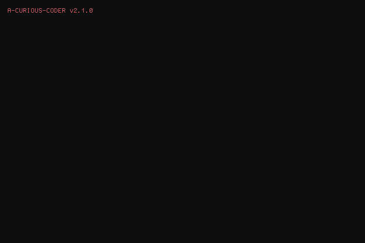

<p align="center">
  
</p>

```
$ whoami
Callum McLennan — full-stack developer
$ cat stack.txt
Rails · Vue · Postgres · DynamoDB · Docker · CI/CD (Semaphore, GitHub Actions)
Also comfortable in Python and Linux.
```

**Featured projects**

- [`mri-deep-learning`](https://github.com/a-curious-coder/mri-deep-learning) — deep learning applied to MRI data.
- [`herdr-plugin-manager`](https://github.com/a-curious-coder/herdr-plugin-manager) — install, run, and manage herdr plugins from a single popup pane.
- [`herdr-iris`](https://github.com/a-curious-coder/herdr-iris) — fuzzy cheatsheet of AI agent skills, scoped to the pane's detected agent.

<p align="center">
  
  
</p>

**Contact:** [cmclennan.dev](https://cmclennan.dev) · Discord `curious_coder`


