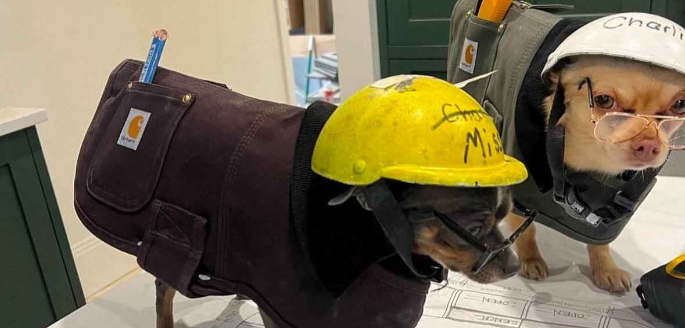

# Hey

I'm a full stack developer working Welcome to my profilewith various technologies throughout the typical software development lifecycle; e.g. ruby on rails, vue js framework, containerisation (docker, kubernetes), ci/cd pipelines via semaphore / github actions.

I'm always striving to improve and learn new things. If you need to contact me, I'm on discord > curious_coder

 

